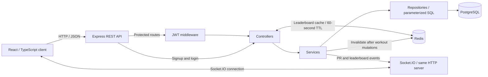

# GymMatch

GymMatch is a full-stack workout tracker for gym-goers who want a clear record of their training and progress. It combines a React and TypeScript interface with a Node.js API for workout history, personal records, and exercise leaderboards with live updates.

## Overview

Tracking progress requires more than remembering the last workout. GymMatch gives users a training journal for sets, reps, weight, duration, rest, and notes, plus a dashboard that summarizes their activity and lifting volume.

The project brings together authenticated REST APIs, relational data modeling, Redis caching, and Socket.IO notifications. Its current scope is workout tracking and exercise rankings; partner matching and messaging are not implemented.

## Key Features

- **Accounts and profiles:** email/password signup and login, JWT-protected API routes, and editable training goals, gym details, experience, and preferences.
- **Workout journal:** create, view, edit, and delete your entries; search exercise names and notes; filter strength, cardio, and personal-record entries.
- **Progress dashboard:** workout counts, total lifted volume (`weight × reps × sets`), recent activity, seven-day active-day counts, and recorded PRs, calculated from workout history.
- **Exercise leaderboards:** top-10 rankings backed by maximum-weight aggregation, a Redis cache, and exercise-specific update events.
- **Personal-record notifications:** new strength records trigger notifications after persistence, delivered to the user's authenticated socket connections. Edits and deletions recalculate affected record flags.
- **Responsive interface:** mobile navigation, loading and error states, retry actions, delete confirmation, and keyboard-accessible dialogs.

## Tech Stack

| Area                | Implementation                                                                                        |
| ------------------- | ----------------------------------------------------------------------------------------------------- |
| Frontend            | React 19, TypeScript, React Router, Axios, Vite, CSS, Lucide icons                                    |
| Backend             | Node.js, Express 5, JavaScript ES modules                                                             |
| Authentication      | JSON Web Tokens (`jsonwebtoken`), password hashing with `bcryptjs`                                    |
| Database            | PostgreSQL, `pg` connection pool, SQL schema and parameterized queries                                |
| Caching             | Redis through the `redis` Node.js client                                                              |
| Real-time           | Socket.IO server and client                                                                           |
| Testing and quality | Node.js integration tests with real PostgreSQL/Redis, Playwright, TypeScript checks, ESLint, Prettier |
| Development and CI  | npm lockfiles, nodemon, Vite development proxy, GitHub Actions workflow                               |

## Architecture



1. Signup and login return a user and a seven-day JWT. The browser stores the session in local storage and sends the token in the `Authorization` header for protected requests.
2. Express routes pass requests through authentication middleware, controllers, services, and repositories. Workout update/delete SQL includes both workout ID and authenticated user ID.
3. PostgreSQL stores accounts, profiles, and workout logs. Repositories join logs with exercise records to return exercise names and types.
4. Leaderboard reads check Redis before querying PostgreSQL. Workout mutations invalidate the relevant cache key and emit an exercise update.
5. Socket.IO verifies the login JWT during the handshake. The browser receives events, displays PR notifications, and refetches the selected leaderboard. The frontend clears the session when a protected HTTP request returns 401.

## Repository Structure

```text
GymMatch/
├── backend/
│   ├── src/
│   │   ├── config/          # PostgreSQL, Redis, schema, seed, and legacy migration
│   │   ├── routes/          # Authentication, profiles, workouts, leaderboards
│   │   ├── controllers/     # HTTP input and response handling
│   │   ├── services/        # Profile/workout logic, PR checks, cache invalidation
│   │   ├── repositories/    # Parameterized SQL queries
│   │   ├── middlewares/     # JWT verification
│   │   ├── utils/          # JWT creation
│   │   ├── app.js          # Express configuration and route registration
│   │   ├── socket.js       # JWT-authenticated connections and event delivery
│   │   └── server.js       # HTTP/Socket.IO startup
│   ├── tests/              # Real PostgreSQL, Redis, HTTP, and socket integration tests
│   ├── scripts/            # JavaScript syntax checks
│   ├── .env.example        # Placeholder-only server configuration
│   └── socketTest.js        # Manual event listener
├── frontend/
│   ├── src/
│   │   ├── api/            # Typed HTTP client and error handling
│   │   ├── components/     # Navigation, forms, dialogs, and tables
│   │   ├── context/        # Session, shared data, sockets, and notifications
│   │   ├── pages/          # Authentication, dashboard, workouts, rankings, profile
│   │   ├── config/         # Optional exercise catalog using existing database IDs
│   │   ├── hooks/          # Abortable resource loading
│   │   └── lib/            # Session storage and formatting helpers
│   ├── tests/              # Browser scenarios and a Socket.IO fixture server
│   ├── .env.example        # Public development defaults
│   └── playwright.config.ts
├── .github/workflows/ci.yml # Frontend checks and backend tests with service containers
├── docs/security-cleanup.md # Credential rotation and manual history-cleanup steps
└── README.md
```

Frontend-specific implementation notes are in [frontend/README.md](frontend/README.md).

## API

All routes use the `/api` prefix. Authentication and health routes are public; profile, workout, and leaderboard routes require `Authorization: Bearer <token>`.

| Method | Endpoint                            | Purpose                                                       |
| ------ | ----------------------------------- | ------------------------------------------------------------- |
| GET    | `/api/health`                       | HTTP liveness response: `{ "status": "ok" }`                  |
| POST   | `/api/auth/signup`                  | Register with `{ email, password }`; return `{ user, token }` |
| POST   | `/api/auth/login`                   | Authenticate and return `{ user, token }`                     |
| POST   | `/api/profile`                      | Create the authenticated user's profile                       |
| GET    | `/api/profile/me`                   | Read your profile                                             |
| PUT    | `/api/profile/me`                   | Update your profile                                           |
| GET    | `/api/profile/:userId`              | Read a profile only when `userId` is your own ID              |
| POST   | `/api/workouts`                     | Log a workout with an existing `exercise_id`                  |
| GET    | `/api/workouts?page=1&limit=10`     | Fetch your workout history; limit is capped at 100            |
| PUT    | `/api/workouts/:id`                 | Update your workout                                           |
| DELETE | `/api/workouts/:id`                 | Delete your workout                                           |
| GET    | `/api/leaderboard?exercise_id=<id>` | Read the selected exercise's leaderboard                      |

Workout fields are `exercise_id`, `weight`, `reps`, `sets`, `duration_minutes`, `rest_time`, `notes`, and `workout_date`. The UI labels weight in kilograms and rest in seconds. The checked-in schema stores numeric workout fields as integers.

## Real-Time Architecture

`backend/src/server.js` attaches Socket.IO to the same HTTP server as Express through `src/socket.js`. The browser sends its login JWT in `auth.token`. The server verifies its signature and expiry, derives the user ID from the token, and joins `user:<userId>`. Missing/invalid tokens are rejected; connected sockets are disconnected at token expiry. The browser opens its connection after login and disconnects when the session ends.

| Event                | Direction              | Behavior                                                                                                            |
| -------------------- | ---------------------- | ------------------------------------------------------------------------------------------------------------------- |
| `register_user`      | Client → server        | Compatibility event: acknowledges only the authenticated user's ID; cannot change identity                          |
| `join_exercise`      | Client → server        | Joins the room `exercise:<exerciseId>`                                                                              |
| `notification`       | Server → user's room   | Sends `{ message, exercise_id }` after committing a new strength PR; reaches all that user's connected tabs/devices |
| `leaderboard_update` | Server → exercise room | Sends `{ exercise_id }` after a workout create, update, or delete and cache invalidation                            |

The leaderboard page joins the selected room, rejoins after reconnection, and refetches only for matching exercise events. The server has no leave-room event; the client filters events from previously joined rooms until the connection closes.

Socket room membership is maintained in memory on one server. Redis currently caches leaderboard responses; it is not a Socket.IO adapter, so cross-instance event delivery is not implemented.

## Database and Caching

The checked-in [schema](backend/src/config/schema.sql) defines:

| Table           | Purpose and relationships                                                                            |
| --------------- | ---------------------------------------------------------------------------------------------------- |
| `users`         | UUID account IDs, unique email addresses, password hashes, timestamps                                |
| `profiles`      | One profile per user through a unique `user_id` foreign key; profile fields and training preferences |
| `exercises`     | Generated integer IDs, names, and strength/cardio type; referenced by workout logs                   |
| `workout_logs`  | Many logs per user, with user/exercise foreign keys; measurements, date, notes, and `is_pr`          |
| `muscle_groups` | Unique group names; currently unused by application routes                                           |

The schema enables `uuid-ossp` and defines indexes on workout user IDs, exercise IDs, and the `(user_id, exercise_id)` pair. User deletion cascades to profiles and workout logs at the database level; there is no account-deletion API.

The repeatable [seed](backend/src/config/seed.sql) supplies six starter exercises without assuming fixed IDs. There is no exercise-list route; the picker uses workout history, an optional local catalog, or an entered database ID. A [legacy migration](backend/src/config/migrations/001_exercises.sql) preserves existing exercise IDs and adds the missing foreign key; it refuses orphan workout references instead of inventing exercise data.

Leaderboard results use the Redis key `leaderboard:exercise:<exerciseId>` with a **60-second TTL**. A cache miss runs a query joining logs, profiles, and exercises, grouped by user and ordered by maximum weight. Users need a profile to appear because the query uses an inner join. Create/delete invalidate their exercise key; moving a workout invalidates both its old and new exercise keys and emits both room updates.

Workout mutations and PR recalculation share a PostgreSQL transaction. A row lock serializes writes for each user. A PR is a non-null strength weight strictly above earlier saved entries, ordered by `created_at` and ID; the first weighted entry qualifies. Changing `workout_date` does not reorder this saved-entry history. Edits/deletions recalculate affected histories, but only newly created PRs send notifications. Redis invalidation and socket events happen after commit. Runtime cache failures do not turn committed writes into HTTP errors; ranking reads fall back to SQL. Failed invalidation or a concurrent cache fill can still leave stale data until its TTL; this is not a cross-system transaction.

Redis is a response cache, not the Socket.IO adapter. The backend awaits the Redis connection during startup, so Redis must be available before the API can begin listening.

## Getting Started

### 1. Prerequisites and clone

- Node.js 24 and npm; local verification used Node.js 24.14.0 and npm 11.9.0.
- PostgreSQL with `psql` and permission to create a database and enable `uuid-ossp`.
- Redis with the `redis-server` command, or a reachable Redis service.
- Git. No Docker or managed deployment configuration is included.

```sh
git clone https://github.com/nithikeshreddy/GymMatch.git
cd GymMatch
npm ci --prefix backend
npm ci --prefix frontend
```

### 2. Configure the backend

```sh
cp -n backend/.env.example backend/.env
```

Edit the untracked `backend/.env`: replace the database username/password placeholders and `JWT_SECRET` with your own local configuration. Generate a new secret locally, for example with `openssl rand -hex 32`. Keep the template free of real credentials. The backend loads `.env` from its working directory, so start it from `backend/`.

### 3. Set up PostgreSQL

Start your PostgreSQL service and use a database role with the permissions described above. For a **new, empty database**, run from the repository root:

```sh
createdb -h localhost -U YOUR_DB_USER -W gymmatch
psql -h localhost -U YOUR_DB_USER -W -d gymmatch -v ON_ERROR_STOP=1 -f backend/src/config/schema.sql
psql -h localhost -U YOUR_DB_USER -W -d gymmatch -v ON_ERROR_STOP=1 -f backend/src/config/seed.sql
psql -h localhost -U YOUR_DB_USER -W -d gymmatch -c 'SELECT id, name, type FROM exercises ORDER BY id;'
```

`YOUR_DB_USER` corresponds to the placeholder in `backend/.env.example`; the commands prompt for your local database password. Do not reapply this non-idempotent schema to an existing database.

Use the returned exercise IDs in the workout picker. Fresh schema and seed initialization are exercised by the backend integration suite. For an existing database created with the old schema, back up your data, run the migration below instead of `schema.sql`, then run `seed.sql` if you want the starter exercises:

```sh
psql -h localhost -U YOUR_DB_USER -W -d gymmatch -v ON_ERROR_STOP=1 -f backend/src/config/migrations/001_exercises.sql
```

The migration stops if workout logs reference absent exercise IDs. Restore those IDs from your known catalog before retrying. It does not rename or overwrite existing exercises. Existing PR flags are recalculated for affected exercises when that user's workouts are next mutated; there is no automatic historical backfill.

### 4. Start Redis

In a separate terminal:

```sh
redis-server --bind 127.0.0.1 --port 6379
```

If Redis already runs as a local service, use that instance. For a different instance, set `REDIS_URL` in your untracked backend configuration.

### 5. Start the API

In another terminal, from the repository root:

```sh
cd backend
npm run dev
```

The default API origin is `http://localhost:3000`. Check HTTP liveness with:

```sh
curl http://localhost:3000/api/health
```

A successful response is `{ "status": "ok" }`. This endpoint is not a database readiness check; inspect startup output for the PostgreSQL connection result.

### 6. Start the frontend

In another terminal, from the repository root:

```sh
cp -n frontend/.env.example frontend/.env.local
cd frontend
npm run dev
```

Open `http://localhost:5173`, sign up, and create a profile. Vite proxies `/api` and `/socket.io` to `BACKEND_URL`, which defaults to `http://localhost:3000`. To log a workout, use an exercise ID that exists in your database. Optionally add exact database IDs and names to [the frontend exercise catalog](frontend/src/config/exercises.ts).

If Vite reports `ECONNREFUSED`, confirm Redis and the API are running and that `BACKEND_URL` matches the backend port. Restart Vite after environment changes.

### Build output

```sh
npm run build --prefix frontend
```

This type-checks the frontend and writes static assets to `frontend/dist/`. `npm run preview --prefix frontend` serves the build for local inspection and inherits the configured API/Socket.IO proxy. The preview server is a local development tool. A static deployment needs its own API/Socket.IO reverse proxy or build-time public endpoint URLs, plus a fallback to `index.html` for frontend routes. A production deployment has not been configured in this repository.

## Environment Variables

Use [backend/.env.example](backend/.env.example) and [frontend/.env.example](frontend/.env.example) as templates. Actual `.env` and `.env.local` files remain ignored. Values prefixed with `VITE_` are public browser configuration and must never contain secrets.

| Variable            | Purpose                                                                       | Required                                                                                             |
| ------------------- | ----------------------------------------------------------------------------- | ---------------------------------------------------------------------------------------------------- |
| `DATABASE_URL`      | PostgreSQL connection string used by the backend pool                         | Yes for the documented setup                                                                         |
| `JWT_SECRET`        | Backend JWT signing and verification secret                                   | Yes; startup checks that it is set                                                                   |
| `PORT`              | API and Socket.IO listening port                                              | No; defaults to `3000`                                                                               |
| `REDIS_URL`         | Backend Redis connection URL                                                  | No; defaults to `redis://localhost:6379`, but Redis itself is required                               |
| `BACKEND_URL`       | Vite development proxy target                                                 | No; defaults to `http://localhost:3000`                                                              |
| `VITE_API_URL`      | Browser HTTP API base URL                                                     | No; defaults to `/api`                                                                               |
| `VITE_SOCKET_URL`   | Browser Socket.IO origin                                                      | No; falls back to the absolute API URL's origin, or the frontend origin when the API URL is relative |
| `CI`                | Playwright CI mode: disallow focused tests and enable two retries             | No; CI runners normally set it                                                                       |
| `TEST_DATABASE_URL` | Dedicated PostgreSQL database ending in `_test` for backend integration tests | Required only for backend tests; never point it at application data                                  |
| `TEST_REDIS_URL`    | Empty, dedicated Redis database 1–15 for backend tests                        | Required only for backend tests                                                                      |
| `SOCKET_TEST_TOKEN` | Current login JWT for the manual socket listener                              | Optional diagnostic use only; set in ignored local configuration                                     |

## Testing

Run the existing frontend checks from the repository root:

```sh
npm run typecheck --prefix frontend
npm run lint --prefix frontend
npm run format:check --prefix frontend
npm run build --prefix frontend
cd frontend
npx playwright install chromium
npm test
```

[The Playwright suite](frontend/tests/app.spec.ts) contains **10 browser tests** covering authentication redirects, profile creation/update, dashboard calculations, workout create/edit/delete, pagination and filtering, session expiry, failed requests, mobile layouts, keyboard focus, leaderboard refreshes, and PR notifications.

HTTP responses are fixtures. Socket events use a real connection to a separate [test server](frontend/tests/socket-server.mjs). Playwright starts its own Vite instance on port `4173` and Socket.IO fixture on `3101`; keep those ports free. It does not require your backend `.env`, PostgreSQL, or Redis. These tests validate client behavior against API-shaped fixtures, **not the live Express/PostgreSQL/Redis implementation**.

The [backend integration suite](backend/tests/integration.test.js) contains **21 tests** using Node.js's built-in runner, real PostgreSQL/Redis, HTTP requests, and authenticated Socket.IO connections. It tests schema/seeds and migration, authentication, ownership, workout CRUD, PR consistency/concurrency, ranking queries, cache behavior/failure, socket authentication, room delivery, and post-commit notifications. See [backend test setup](backend/tests/README.md) for disposable service commands and safeguards.

From the repository root, with those dedicated services running:

```sh
npm run check --prefix backend
TEST_DATABASE_URL=postgresql://gymmatch_test@127.0.0.1:55432/gymmatch_test TEST_REDIS_URL=redis://127.0.0.1:56379/15 npm test --prefix backend
```

Backend tests do not load `.env`; their signing secret is randomly generated in memory. `npm run check` checks JavaScript syntax, not lint or types. The [manual socket helper](backend/socketTest.js) is separate: set `SOCKET_TEST_TOKEN` in ignored local configuration and invoke `node socketTest.js <user-id> <exercise-id>` from `backend/`.

[GitHub Actions](.github/workflows/ci.yml) runs separate frontend and backend jobs on pushes to `main`/`master` and pull requests. The frontend job installs dependencies, lints, builds/type-checks, and runs Playwright. The backend job installs dependencies, checks syntax, and runs integration tests with PostgreSQL 16 and Redis 7 service containers. The workflow has no deployment step or production secrets. Local checks have been run; GitHub-hosted execution must be verified after pushing.

## Engineering Decisions

- **PostgreSQL for related data:** foreign keys connect accounts, profiles, and logs; SQL joins and aggregation express workout history and per-exercise rankings. Repositories use bound parameters for supplied values.
- **Redis for leaderboard reads:** a short-lived cached response avoids repeating the aggregation on every request for the same exercise. Invalidation is tied to workout mutations. No latency or throughput improvement has been benchmarked.
- **Socket.IO for notifications:** exercise rooms scope ranking updates, and authenticated user rooms route PR messages to all connected sessions. Clients refetch authoritative data after receiving an update event.
- **Backend layers:** routes, controllers, services, and repositories separate HTTP handling, workout rules, and SQL access. Socket initialization is separate from the listening entry point so integration tests exercise the actual application on an ephemeral port.
- **Transactions for derived records:** user-row locks serialize workout writes, and a SQL window aggregation recalculates PR flags in the same transaction. Cache invalidation and notifications follow commit, so failed SQL writes produce no success events.
- **Typed client integration:** TypeScript models request/response shapes; a shared HTTP client handles bearer tokens and errors. Abortable loads prevent obsolete requests from replacing newer page data. The browser currently loads all history pages for complete local search and dashboard calculations.

## Current Limitations / Future Improvements

1. **Complete credential remediation.** The original backend environment file remains in Git history. Rotate exposed credentials and follow the [manual cleanup guide](docs/security-cleanup.md); ignoring a file does not remove historical copies. Real environment files remain ignored, and tracked templates contain only placeholders/public defaults.
2. **Improve cache/event guarantees.** PostgreSQL, Redis, and socket delivery are separate systems. Cache fills can race with invalidation, and events are not durably retried. Current cache TTL bounds stale entries; Redis is required at startup.
3. **Harden deployment configuration.** Restrict CORS, strengthen general request validation and rate limiting, and consider token revocation and session storage policy. HTTP and socket connections verify JWTs, but there is no server-side revocation list.
4. **Expand end-to-end verification.** Connect browser tests to the real backend, add more failure scenarios, and benchmark before making performance claims. Backend integration tests use real services; existing browser tests use HTTP fixtures.
5. **Prepare deployment and larger histories.** Add a tested full-stack deployment setup, server-side filtering/summary queries, readiness checks, and structured observability. Multiple API instances need a shared Socket.IO adapter; the exercise picker still requires known database IDs for first-time logging.

## Author

**Nithikesh Reddy Bobbili**

[GitHub](https://github.com/nithikeshreddy) · [LinkedIn](https://linkedin.com/in/nithikesh-reddy)
